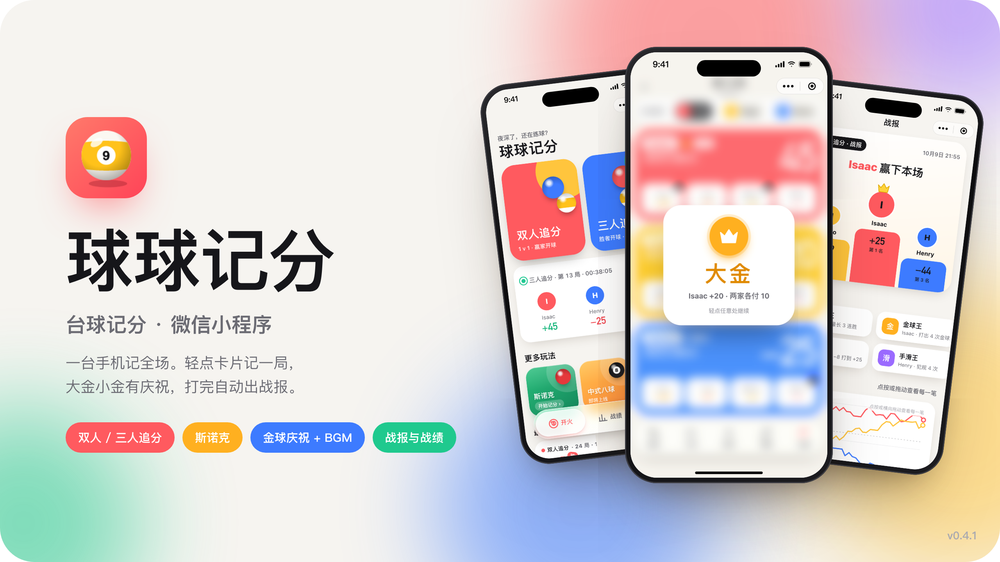
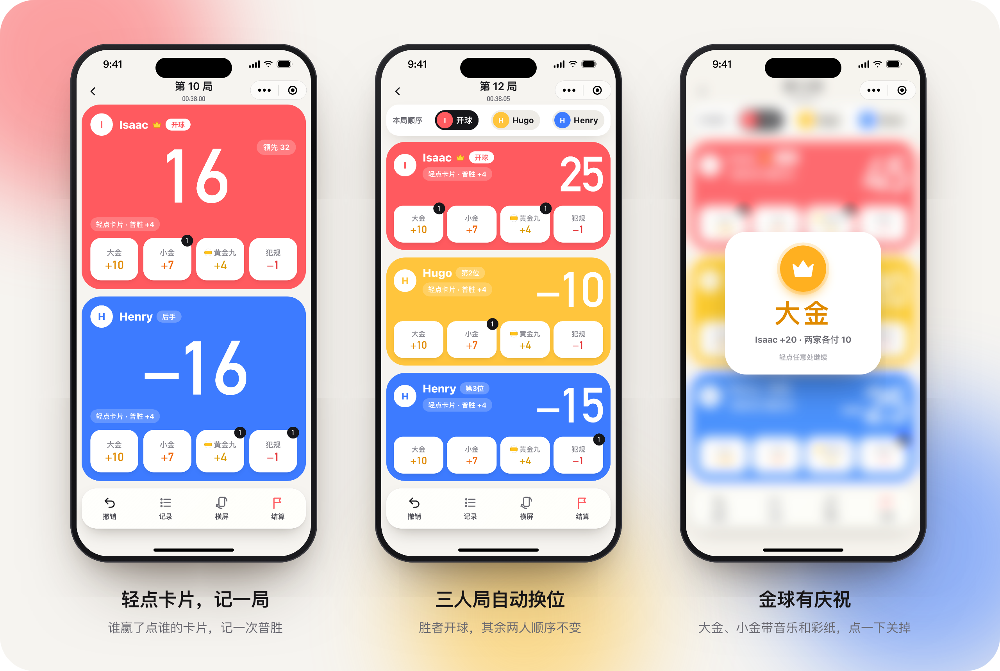
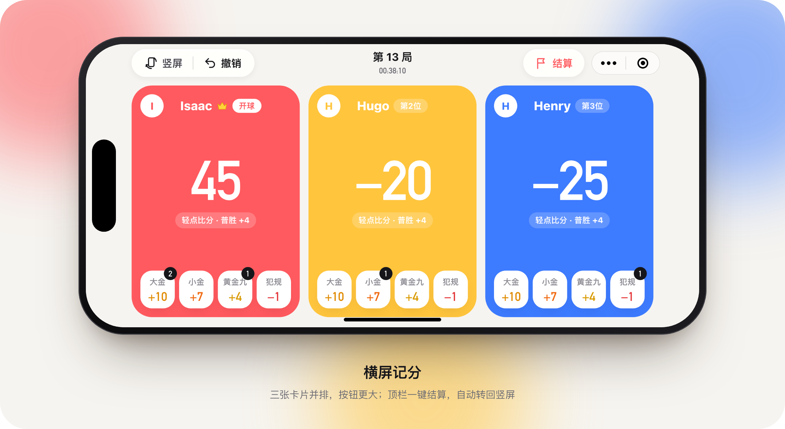
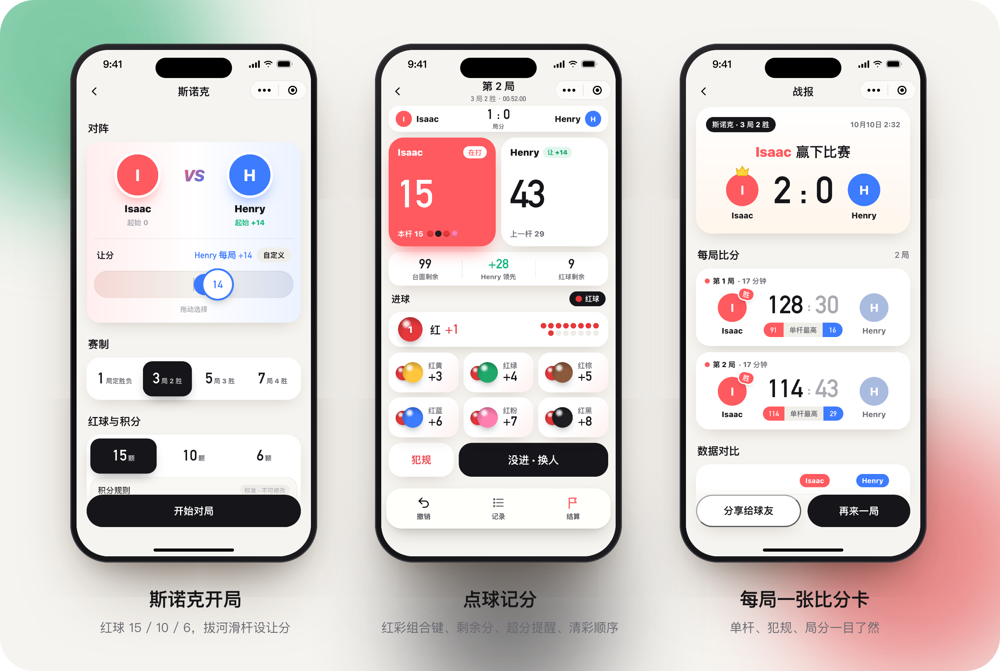
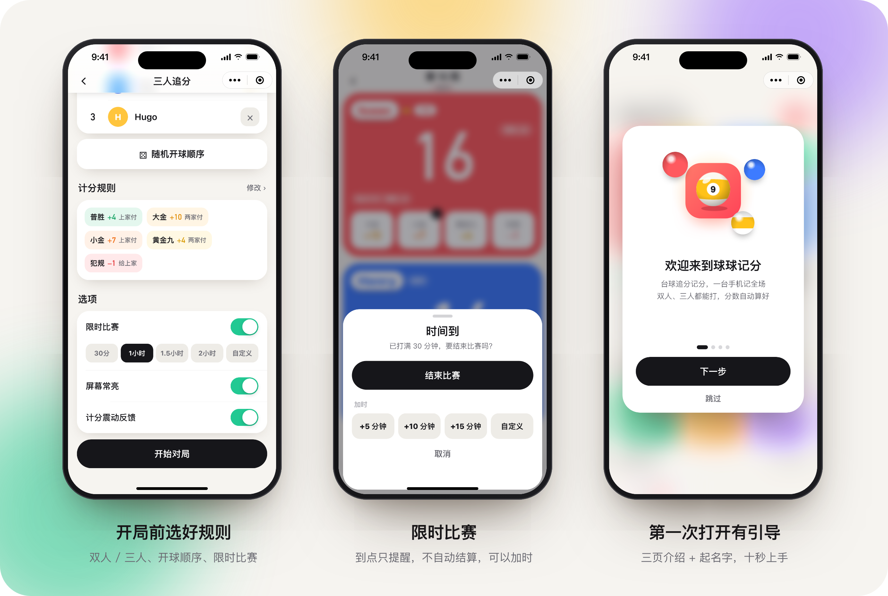
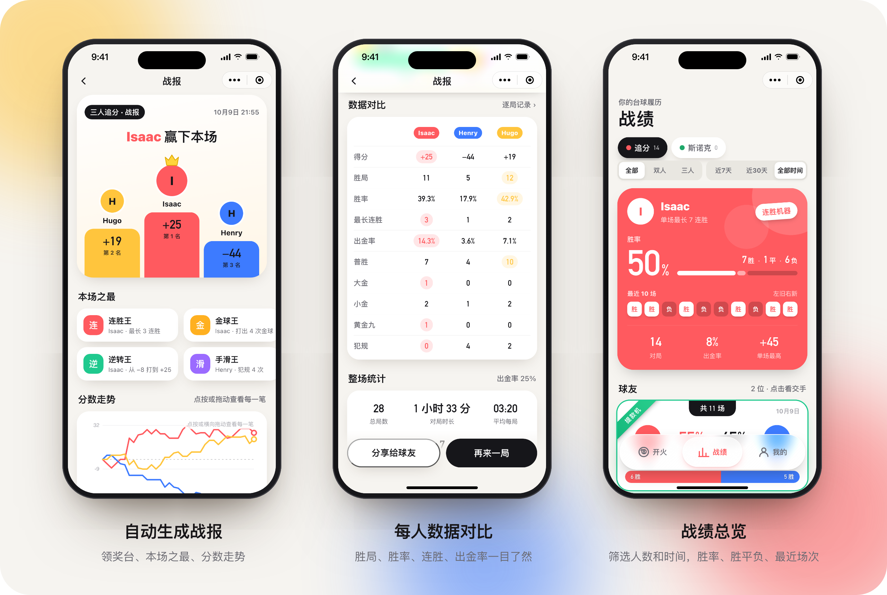
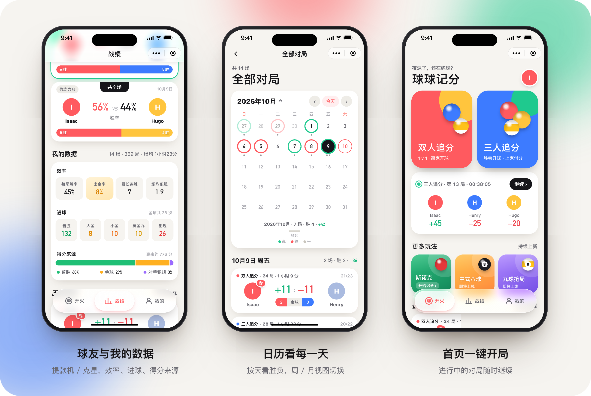
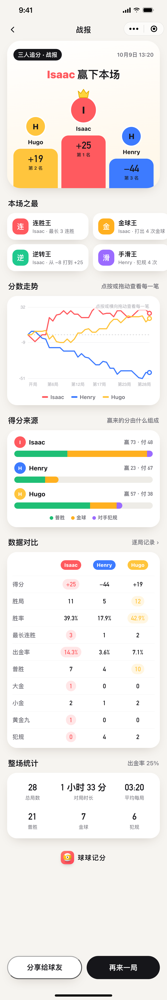

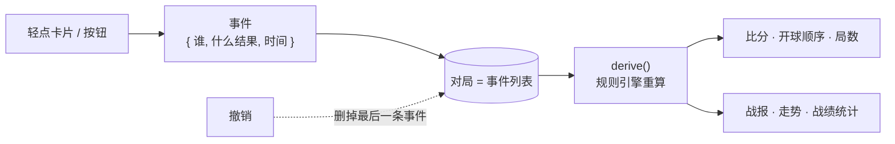

<p align="center">
  
</p>

<p align="center">
  
  
  
  
</p>

<p align="center">
  <b>台球记分小程序</b> · 追分 + 斯诺克 · 一台手机记全场<br>
  轻点卡片记一局，大金小金有庆祝，打完自动出战报
</p>

<br>

## 记分：点一下就好

<p align="center"></p>

- **轻点卡片 = 普胜**：谁赢了点谁的卡片；大金、小金、黄金九、犯规点卡片下面的按钮
- **自动算分、自动换位**：谁付分、下一局谁开球都按规则算好；三人局卡片会跟着开球顺序重新排
- **金球有仪式感**：大金 / 小金 / 黄金九带 BGM 和彩纸，犯规也有奖章弹窗；记错了随时撤销，记录页左滑可编辑 / 删除
- **名字牌 + 暂停**：卡片上的名字是白底大字，放远也认得出；中途休息点「暂停」，计时和自动保存都停住

<p align="center"></p>

## 斯诺克

<p align="center"></p>

- **开局**：红球 15 / 10 / 6 颗，单局或 3 / 5 / 7 局多胜，拔河滑杆设让分
- **点球记分**：「红 + 彩」组合键一下记两颗；实时显示台面剩余分和领先分，超分时提醒；清彩阶段按顺序亮起
- **犯规**：罚 4–7 分给对手，可记同时进袋的红球；只剩黑球时犯规直接结束本局，打平重摆黑球
- **战报**：每局一张比分卡，单杆最高、用时一目了然；战绩、交手、历史日历都能单独看斯诺克

## 开局、限时、上手

<p align="center"></p>

- **限时比赛**（默认关闭）：30 分钟到 2 小时一键选，或用滚轮自定义；到点震动提醒，**只提醒、不自动结算**，可以 +5 / +10 / +15 分钟或自定义加时
- **30 分钟没操作自动保存**：打完忘了结算也不会丢；之后还能「继续这局」，空档时间不算进时长
- **新手引导**：第一次打开三页介绍 + 起名字；双人、三人局第一次记分各有三步提示

## 战报与战绩

<p align="center"></p>
<p align="center"></p>

- **战报**：领奖台、本场之最（连胜王 / 金球王 / 逆转王 / 手滑王）、可拖动的分数走势、每人数据对比，平局单独处理
- **战绩**：顶部按人数、时间筛选；名片看胜率和最近 10 场，球友关系（「提款机」「克星」「势均力敌」），效率 / 进球 / 得分来源分组，8 枚成就
- **历史日历**：按天看胜负和净胜分，周视图 / 月视图切换

<details>
<summary><b>查看完整长截图</b>（战报 · 战绩）</summary>
<br>
<p align="center">
  
  &nbsp;&nbsp;
  
</p>
</details>

## 追分规则

| 结果 | 分值 | 双人 | 三人 |
| :-- | :-: | :-- | :-- |
| 普胜 | **+4** | 对手付 | 上家付 |
| 小金 | **+7** | 对手付 | 上家付 |
| 大金 | **+10** | 对手付 | 两家各付 |
| 黄金九 | **+4** | 对手付 | 两家各付 |
| 犯规 | **−1** | 给对手 | 给上家（可改为下家） |

- **双人**：赢家开下一局
- **三人**：胜者排到第一位开球，其余两人保持原来的相对顺序
- 分值和付分方式都可以在「计分规则」里改，也可以设成新对局的默认规则

## 技术实现

原生微信小程序（WXML / WXSS / JS），没有引入任何框架或第三方库。



- **事件溯源**：一场对局只存「发生了什么」，比分、顺序、统计都由 `utils/engine.js` 的纯函数 `derive()` 重新算出来。撤销就是删掉最后一条事件，改规则也不会把历史算错
- **本地存储**：按月分开存（单个 key ≤ 1 MB），记分时只写进行中的那一局；带数据版本号，页面数据没变就不重新渲染
- **动效**：卡片换位用 FLIP 位移动画，液态玻璃 Tab 栏，低端安卓机自动关掉模糊
- **版本区分**：开发版自动载入演示数据、显示测试按钮；体验版 / 正式版干干净净

<details>
<summary><b>目录结构</b></summary>

```
小程序/
├─ miniprogram/
│  ├─ utils/
│  │  ├─ engine.js     追分规则引擎（纯函数：分值、付分、开球顺序、胜负平）
│  │  ├─ snooker.js    斯诺克规则引擎（剩余分、清彩顺序、犯规、重摆黑球、让分）
│  │  ├─ store.js      本地存储（球友、进行中的对局、按月分存的历史）
│  │  ├─ stats.js      战绩统计、成就、交手（snk-stats.js 为斯诺克）
│  │  ├─ report.js     战报数据
│  │  ├─ limit.js      限时比赛
│  │  ├─ idle.js       30 分钟没操作自动保存
│  │  └─ env.js        开发版 / 体验版
│  ├─ behaviors/     scoring.js 追分记分（竖屏 / 横屏共用）、snooker.js 斯诺克记分
│  ├─ components/      导航栏、面板、走势图、时间到、新手引导…
│  ├─ custom-tab-bar/  液态玻璃 Tab
│  └─ pages/           首页、新对局、记分、横屏、战报、战绩、日历、交手、球友、我的、斯诺克（snk-*）…
├─ scripts/
│  ├─ ci.js            预览 / 上传（miniprogram-ci）
│  ├─ smoke.js         冒烟测试（模拟微信环境跑所有页面和核心流程）
│  └─ shots/           README 截图生成（真实页面数据 → HTML → 无头 Chrome）
原型设计/              早期交互原型（HTML）
docs/screenshots/      README 用图（npm run shots 生成）
```
</details>

## 开发

```bash
cd 小程序
npm install
npm run smoke      # 冒烟测试
npm run preview    # 生成预览二维码（开发版）
npm run shots      # 重新生成 README 截图（需要本机装有 Chrome）
npm run upload -- 0.4.1 "更新说明"   # 上传新版本，到小程序后台设为体验版
```

> 上传需要小程序后台的代码上传密钥和 IP 白名单；密钥只在本机使用，不在仓库里。

## 版本

每个版本都有对应的 [tag](../../tags) 和 [Release](../../releases)，完整记录见 [CHANGELOG](CHANGELOG.md)。

| 版本 | 主要内容 |
| :-- | :-- |
| **0.4.1** | 金球音乐静音模式下也播放（跟随媒体音量） |
| 0.4.0 | 斯诺克、暂停、名字牌、战绩改版、记录左滑编辑 / 删除 |
| 0.3.0 | 平局、限时比赛、30 分钟自动保存、横屏结算、新手引导、体验版不含演示数据 |
| 0.2.2 | 液态玻璃 Tab「开火 / 战绩 / 我的」、金球 BGM、历史日历 |
| 0.2.1 | 演示数据（Isaac / Henry / Hugo） |
| 0.2.0 | 全面打磨界面和动效，自定义面板替换系统弹窗 |
| 0.1.0 | 跑通：双人 / 三人追分、记分、战报、战绩 |

## 接下来

- [ ] **0.4.x**：修复已知小问题（斯诺克一杆多红、记录页与自动保存、历史页斯诺克汇总等）
- [ ] 数据结构为同步做准备（唯一 ID、删除标记、对局摘要）
- [ ] 赛后认领 —— 战报海报带二维码，球友扫码把战绩存到自己的账号（云开发）
- [ ] 扫码进房间 —— 球友加入对局，各自手机实时看比分
- [ ] 中式八球、九球抢局

<br>
<p align="center"><sub>球球记分 · 为每一杆好球记上一笔</sub></p>
